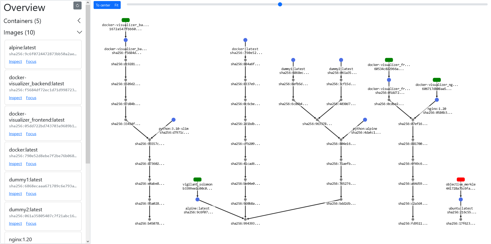
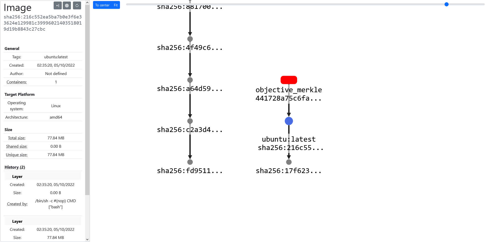
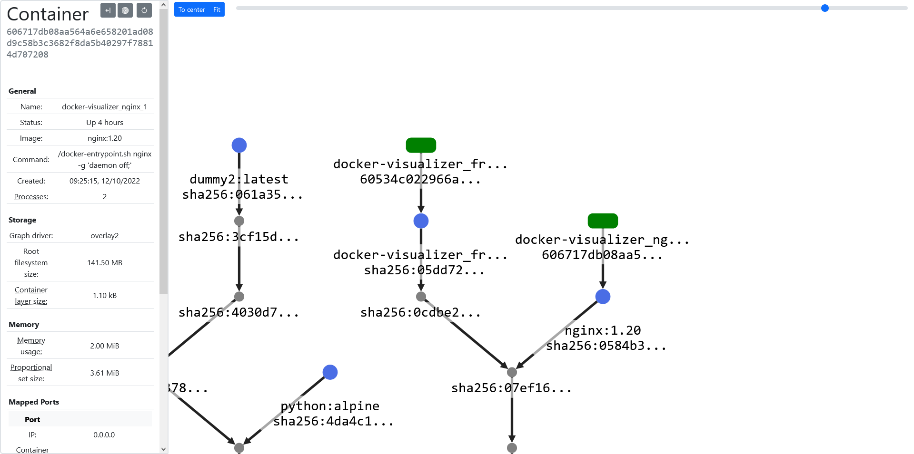
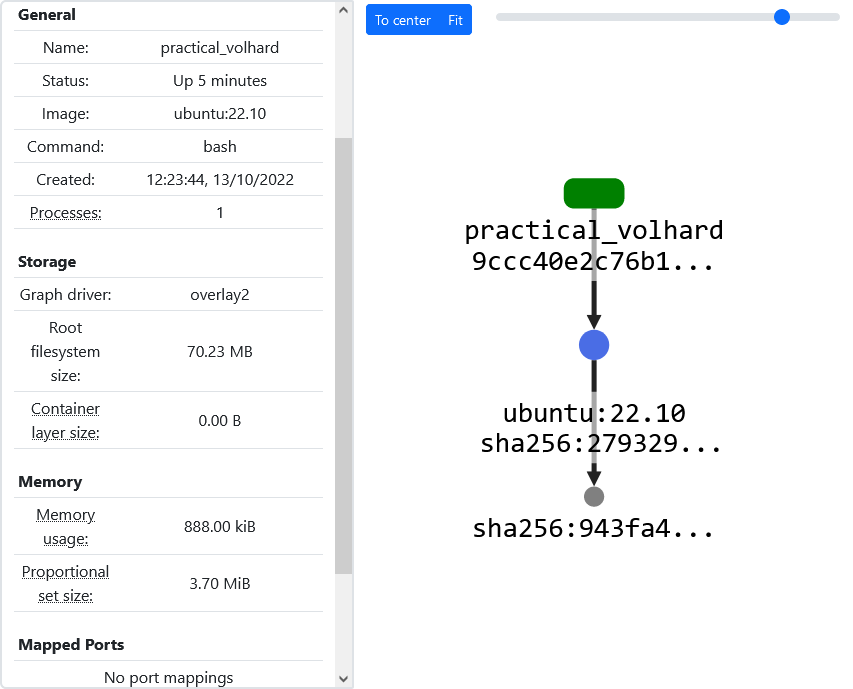
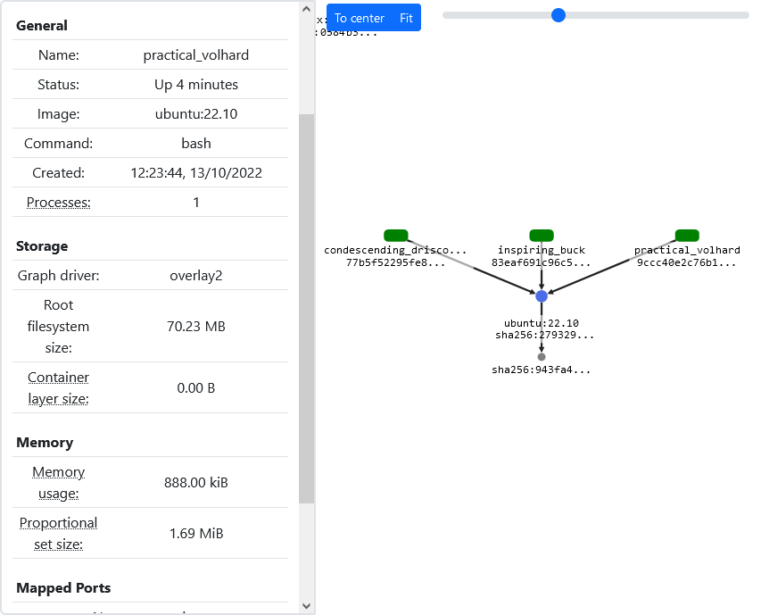
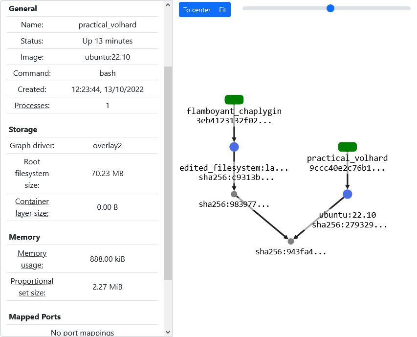

# Docker visualizer

A tool for visualizing the relationships between local Docker Linux containers, images, and image layers.

The application is run in Docker containers and it visualizes the relationships between Docker images, containers, and layers on the same host. The application is intended for educational purposes.

The application consists out of two components: _frontend_ and _backend_. The backend collects all the information displayed by the frontend. The frontend is a browser application that provides a dashboard and a graph for visualizing the data provided by the backend. The backend provides API documentation at its root URL. For more information about these components, see their respective directories.

## How to run

The recommended way to run the application is with the command:

```
docker-compose up
```

After the containers are ready, the application is available at http://localhost:8080.

**_NOTE:_** The backend has specific requirements in order to work as expected. For example, it should be run with privileges, and it should have access to the host Docker UNIX socket. See backend/README.md for more information. The frontend needs the backend API URL defined as a build-time ENV variable. When run with docker-compose, all these configurations are already set.

The application is intended to be run with docker-compose.yml. docker-compose.dev.yml is intended for development. It helps debugging, and provides automatic restart for the backend.

When run with `docker-compose up` the application consist out of three containers. The frontend container contains the frontend application. The backend container contains the backend application. The nginx container acts as a reverse proxy for the frontend and the backend applications.

The application does not modify the host system in any way. The application can be removed without leaving a trace by deleting the application containers, for example with the command `docker-compose down`.

## Overview

The application visualizes the relationships between local Docker images, containers, and image layers using a graph.



In the graph, rectangular nodes represent containers. Green container nodes represent running containers and red container nodes represent containers that are not running. Blue circle nodes represent images, and gray circle nodes represent image layers. The nodes are labelled with their IDs, and the container nodes are labelled with the container names and the image nodes are labelled with a tag.

An edge from a container node to an image node means that the container is based on the image represented by the image node. An edge from an image node to a layer node means that the layer is the last layer in the layer hierarchy of the image. Edges between layer nodes represent image layer hierarchies. An edge from a layer node to a layer node means that the source layer is applied on top of the target layer in the layer hierarchy of an image.




An image or a container can be selected to view information about it. Most information visible in the application is obtained through Docker API.





In addition to the information obtained through Docker API, the application adapts the _proportional set size_ (PSS) memory metric for containers. The PSS memory metric is an useful metric for demonstrating the memory sharing between containers.

## Compatibility

Docker supports both Windows and Linux containers, but the application is designed only to be used with Linux containers. Docker can run Linux containers on Windows, Linux, and macOS platforms. The application is developed and mainly tested on Windows 10. The application was also briefly and successfully tested on a few Linux systems. In principle, the application should work on platforms with compatible Docker versions.

The application is developed and tested with Docker version 20.10. Docker API used by the Docker SDK is backwards compatible, making the application compatible with Docker versions 20.10 or better. The application is not tested with older Docker versions. The application may work with older Docker versions.

PSS calculation may not work properly under all Docker setups. The application is designed to handle the cases where PSS is not available gracefully.

## Troubleshooting & Issues

If port 8080 is taken, you can change the port by editing nginx port mapping in docker-compose file.

The backend errors are logged to the console. Docker related errors on start-up probably mean that the Docker socket is not available for the container, or Docker daemon is not running.

Rendering large graphs may take a while.
